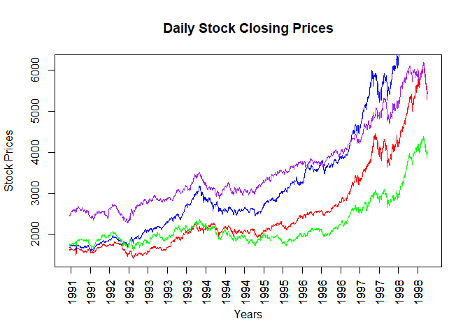

# EDA CIA 001

## The Team

We are the Avengers. Our team is made up of the following people: <br />
<br /> 1. Nimisha Mary Sam - 24221132<br /> 2. Nidhi Jaidev -
24221131<br /> 3. Ujjwal Akshith Mondreti- 24221051<br />

## What we have learnt till CIA 1

We learnt about the various types of data in R.

``` r
print(typeof("ABC123!@#"))
```

    ## [1] "character"

``` r
print(typeof(12345))
```

    ## [1] "double"

``` r
print(typeof(12345.67))
```

    ## [1] "double"

Afterwards, we learnt about Vectors and operations on Vectors in R.

``` r
x <- c(1, 2, 3, 4, 5)
y <- c(1, 2, 3, 4, 5)

print(x+y)
```

    ## [1]  2  4  6  8 10

``` r
print(x*y)
```

    ## [1]  1  4  9 16 25

``` r
print(x-y)
```

    ## [1] 0 0 0 0 0

``` r
print(x/y)
```

    ## [1] 1 1 1 1 1

## Description of the Dataset

We selected the EuStockMarkets dataset from the built-in datasets
library. It contains the daily closing prices of four of the major stock
indices in the European Union, i.e., Germany (DAX), Switzerland (SMI),
France (CAC) and the UK (FTSE) from 1991 to 1998.

The summary of the dataset is given below:

``` r
summary(EuStockMarkets)
```

    ##       DAX            SMI            CAC            FTSE     
    ##  Min.   :1402   Min.   :1587   Min.   :1611   Min.   :2281  
    ##  1st Qu.:1744   1st Qu.:2166   1st Qu.:1875   1st Qu.:2843  
    ##  Median :2141   Median :2796   Median :1992   Median :3247  
    ##  Mean   :2531   Mean   :3376   Mean   :2228   Mean   :3566  
    ##  3rd Qu.:2722   3rd Qu.:3812   3rd Qu.:2274   3rd Qu.:3994  
    ##  Max.   :6186   Max.   :8412   Max.   :4388   Max.   :6179

## Plotting the Stock Prices

We plotted all of the stock closing prices per day from 1991 to 1998. We
assigned Red to DAX, Blue to SMI, Green to CAC and Purple to FTSE.

``` r
x <- seq_len(nrow(EuStockMarkets))

plot(x, EuStockMarkets[, "DAX"], type="n", main = "Daily Stock Closing Prices", xaxt="n", ylab="Stock Prices", xlab="Years")

colors <- c("red", "blue", "green", "purple")

for (i in seq_len(ncol(EuStockMarkets))) {
  lines(x, EuStockMarkets[,i], col=colors[i])
  years <- as.integer(time(EuStockMarkets))
  tick.posis <- seq(10, length(years), by = 100)
  axis(1, at = tick.posis, las = 2, labels = years[tick.posis])
}
```



## Data Dictionary

The data dictionary of the dataset is given below:

``` r
for (i in 1:10) {
  print(c(EuStockMarkets[i, ]))
}
```

    ##     DAX     SMI     CAC    FTSE 
    ## 1628.75 1678.10 1772.80 2443.60 
    ##     DAX     SMI     CAC    FTSE 
    ## 1613.63 1688.50 1750.50 2460.20 
    ##     DAX     SMI     CAC    FTSE 
    ## 1606.51 1678.60 1718.00 2448.20 
    ##     DAX     SMI     CAC    FTSE 
    ## 1621.04 1684.10 1708.10 2470.40 
    ##     DAX     SMI     CAC    FTSE 
    ## 1618.16 1686.60 1723.10 2484.70 
    ##     DAX     SMI     CAC    FTSE 
    ## 1610.61 1671.60 1714.30 2466.80 
    ##     DAX     SMI     CAC    FTSE 
    ## 1630.75 1682.90 1734.50 2487.90 
    ##     DAX     SMI     CAC    FTSE 
    ## 1640.17 1703.60 1757.40 2508.40 
    ##     DAX     SMI     CAC    FTSE 
    ## 1635.47 1697.50 1754.00 2510.50 
    ##     DAX     SMI     CAC    FTSE 
    ## 1645.89 1716.30 1754.30 2497.40

## Business Implications

The dataset used in this report, EuStockMarkets, consists of daily
closing prices for four major European stock indices—DAX (Germany), SMI
(Switzerland), CAC (France), and FTSE (UK)—from 1991 to 1998.

1.  **Market Trend Analysis:**
    -   The dataset allows businesses and investors to analyze
        historical trends in European stock markets. This can aid in
        identifying patterns in stock price movements and economic
        cycles.
2.  **Risk Assessment & Portfolio Management:**
    -   By studying the fluctuations in stock indices, financial
        analysts can assess risks associated with investments in
        European markets. This helps in developing diversified
        portfolios to minimize risk.
3.  **Investment Strategies & Forecasting:**
    -   Investors can use past trends to develop predictive models,
        enabling them to make informed decisions about future
        investments and hedging strategies.
4.  **Macroeconomic Impact:**
    -   The dataset reflects economic events and policies of the time.
        Businesses can study how macroeconomic changes, such as
        inflation, interest rate changes, and political events, impacted
        stock prices.
5.  **Market Correlation Studies:**
    -   The dataset enables businesses to analyze correlations between
        different European markets, which is valuable for multinational
        corporations and institutional investors managing international
        portfolios.
